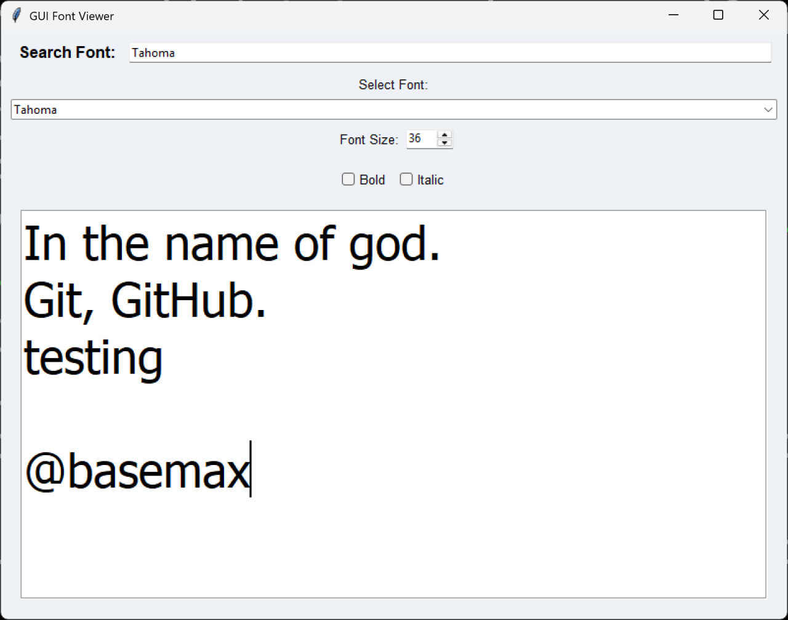

# GUI Font Viewer

**GUI Font Viewer** is a Python application that provides a user-friendly interface to explore and experiment with the fonts available on your system. It allows users to search, select, and customize fonts in real-time.

## Features

- **Search and Filter Fonts**: Quickly find fonts by name.
- **Font Size Adjustment**: Change font size dynamically using a spinbox.
- **Text Style Customization**: Apply bold and italic styles to the text.
- **Copy to Clipboard**: Easily copy the displayed text for use in other applications.



## Requirements

- Python 3.6 or later
- `tkinter` (included in most Python installations)

## Installation

1. Clone the repository:

   ```bash
   git clone https://github.com/BaseMax/font-viewer.git
   cd font-viewer
   ```

2. Install any necessary dependencies:

   ```bash
   pip install -r requirements.txt
   ```

   *(Note: `tkinter` is usually pre-installed with Python. If not, install it using your system's package manager.)*

## Usage

Run the application using the following command:
```bash
python font_viewer.py
```

Once launched, the GUI will open, allowing you to explore and test fonts on your system.

## Contributing

Contributions are welcome! Feel free to submit issues or pull requests on the [GitHub repository](https://github.com/BaseMax/font-viewer).

## License

This project is licensed under the MIT License. See the `LICENSE` file for more details.


© 2025, Max Base. All rights reserved.
